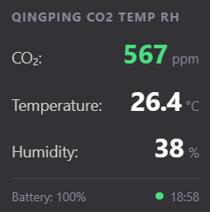
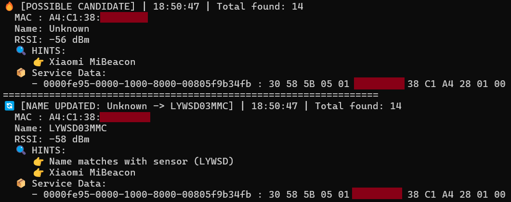

  
*(generated by AI, but it looks so fancy)* 😍

# AirMonitor
*(built with help of AI)* 🤖

A lightweight Python application that connects to Bluetooth Low Energy (BLE) environmental sensors/air monitors and
provide a local web widget for overlays, OBS, or VR setups.

## Description
**AirMonitor** periodically reads metrics (such as temperature, humidity, and battery levels) from supported BLE
sensors and exposes them through a lightweight local web sever. The data is rendered via an included HTML widget.

---

## Getting Started

### 1. Download & Installation
1. Go to the **[Releases](../../releases)** page and download the latest archive.
2. Extract the contents (the `.exe` file and the widget `.html` file) into a directory of your choice.

### 2. Configuration
1. Run the executable once. It will automatically generate a default `.env` configuration file in the same directory
and then exit.
2. Open the `.env` file in any text editor:
   - **Set the sensor type**: Specify your sensor type (currently only `qingping_tlv` and `bt_home` are supported).
   - **MAC Address filtering (optional)**: If you have multiple BLE devices nearby, uncomment the MAC filter line and
set your sensor's MAC address. This also helps reduce background CPU load from processing unrelated BLE advertisements.

> ⚠️️ **Important Note for Xiaomi LYWSD03MMC users:**  
> Stock Xiaomi firmware encrypts broadcast packets or uses proprietary formats. To use this sensor, you must flash it
> with custom **BTHome**-compatible firmware (e.g., via
> [Telink Flasher](https://pvvx.github.io/ATC_MiThermometer/TelinkMiFlasher.html)). **Do this at your own risk!**

## Web Widget

Once configured, launch the main executable normally. The web widget will be available at:

http://127.0.0.1:27111



You can open this URL in any browser, add it as an OBS Browser Source, or embed it into custom desktop widgets.

---

## OVR Toolkit custom application
An **OVR Toolkit** custom application, allowing SteamVR users to keep track of their air quality directly in virtual
reality.


> ℹ️ Proper description will be added after publication. The source code is available under `ovrt_app` directory if
> you want to test it locally.

## BLE Sniffer
If you are unsure of your sensor's MAC address or advertising protocol, use the built-in sniffer:

1. Open a terminal (PowerShell / Command Prompt) in the app folder.
2. Launch the executable with the `--sniffer` flag:
   ```cmd
   AirMonitor.exe --sniffer
   ```
3. Look through the detected devices to find your sensor and note down its MAC address for the .env file.


